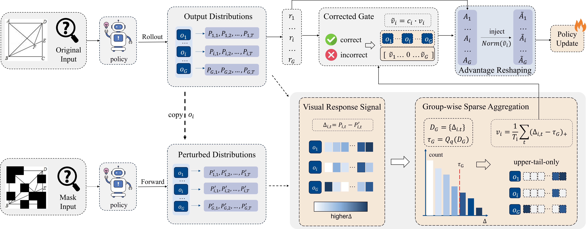
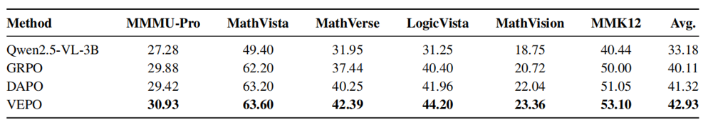

<div align="center">


本项目基于 [EasyR1](https://github.com/hiyouga/EasyR1) 进行扩展，在高效、可扩展的 RLVR 训练框架中加入面向多模态推理的感知增强训练信号。本项目的主要实现集中在 `verl/trainer/ray_trainer.py`：训练器会构造增强后的视觉输入，计算原图与增强图之间的对比式 log-probability 信号，进一步得到 visual-dependence score，并将该信号注入到 advantage 计算中。


## Key Highlights / 主要亮点

- **感知增强的 RL 训练：** 在 RL rollout 阶段引入基于视觉扰动的对比式训练信号。
- **兼容 EasyR1 原始训练流程：** 保留 Ray/FSDP/vLLM 的核心数据流，同时加入多模态感知信号。
- **Visual-dependence advantage injection：** 使用视觉依赖度信号调制 token-level advantages。
- **支持在线和离线视觉增强：** 既可以读取预处理好的 `image_aug` 字段，也可以在线执行 random patch blackening。
- **兼容 EasyR1 算法路径：** 设计上可配合 GRPO 类训练流程以及 online filtering 使用。

## Methodology / 方法

### Motivation / 动机

多模态 RL 训练通常会奖励最终答案是否正确，但这并不一定能显式鼓励模型真正依赖视觉信息。模型可能在部分样本中依靠语言先验、题型模式或捷径获得奖励。为了解决这一问题，本项目通过比较模型在原始图像和视觉扰动图像上的行为差异，引入一个感知增强训练信号，使训练过程更加关注模型对视觉证据的依赖程度。

### Perception-Aware Trainer / 感知增强训练器

下图展示了本项目中感知增强训练器的整体框架：
<div align="center">

</div>

训练主循环中加入了四个关键模块：

1. **构造增强图像输入**

   当 `algorithm.use_kl_prcp=true` 时，trainer 会构造 `aug_multi_modal_data`。增强图像来源包括：

   - 数据中预处理好的 `image_aug` 字段；
   - 或者通过 `verl/trainer/image_utils.py` 中的 `random_patch_blackening` 在线生成。

2. **计算对比式 log-probability**

   Trainer 会在原始图像输入上计算 `old_log_probs`，并在增强后的视觉输入上计算 `aug_log_probs`。

3. **推导 visual-dependence score**

   `derive_visual_dependence_from_log_probs` 会比较原图和增强图下有效 response token 的 log-probability 差异，以估计每条 response 对视觉信息的依赖程度。

4. **注入 advantage**

   `inject_visual_advantage` 会将 sequence-level 的 visual-dependence 信号注入到 token-level advantages 中，并支持 group normalization 和 gating。

### Core Implementation Map / 核心实现对应关系

| 模块 | 文件 | 作用 |
| --- | --- | --- |
| Ray trainer 数据流 | `verl/trainer/ray_trainer.py` | 主要贡献：rollout、增强图 log-prob 计算、reward 整合、advantage injection |
| 算法配置 | `verl/trainer/config.py` | 增加感知增强相关配置，例如 `use_kl_prcp`、`visual_advantage_coef` 和 `aug_config` |
| 图像增强 | `verl/trainer/image_utils.py` | 提供在线 random patch blackening，用于构造扰动后的视觉输入 |
| 示例配置 | `examples/config.yaml` | 展示如何开启感知增强训练 |


### Main Results / 主要结果
<div align="center">

</div>


## Configuration / 配置

可以通过以下配置开启感知增强训练：

```yaml
algorithm:
  use_kl_prcp: true
  contrastive_type: augmented
  visual_advantage_coef: 0.1
  visual_advantage_key: visual_dependence
  visual_advantage_gate_key: visual_adv_gate
  visual_advantage_group_norm: zscore
  visual_advantage_eps: 1.0e-6
  aug_config:
    patch_size: 14
    black_prob: 0.6
```

关键字段说明：

- `use_kl_prcp`：开启增强图像下的 log-probability 计算。
- `contrastive_type`：当前支持 `augmented`。
- `visual_advantage_coef`：控制 visual-dependence advantage injection 的强度。
- `visual_advantage_group_norm`：支持 `none`、`center`、`zscore`。
- `aug_config.patch_size`：在线图像扰动时使用的 patch size。
- `aug_config.black_prob`：每个图像 patch 被置黑的概率。


```

最小配置示例可参考：

```text
examples/config.yaml
```

### Data Format / 数据格式

Trainer 支持 EasyR1 标准的多模态数据格式。对于感知增强训练，每条样本可以额外提供预处理好的增强图像：

```python
{
    "prompt": "...",
    "answer": "...",
    "images": [...],
    "images_aug": [...],  # 可选；如果没有该字段，则使用在线图像增强
}
```

如果样本中没有 `images_aug`，trainer 会基于原始 `images` 在线生成增强图像。


```

